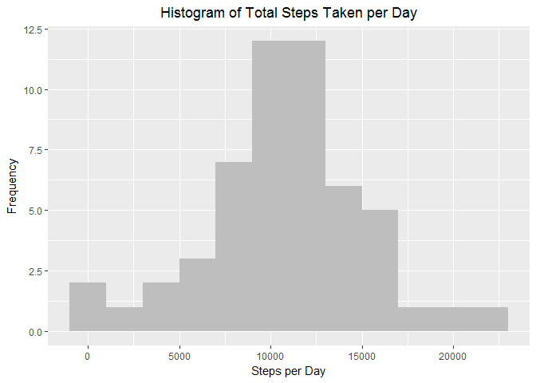
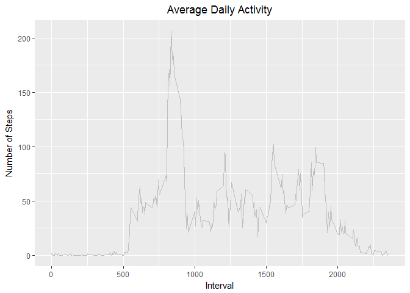
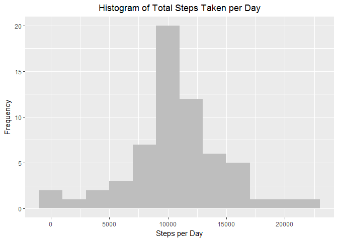
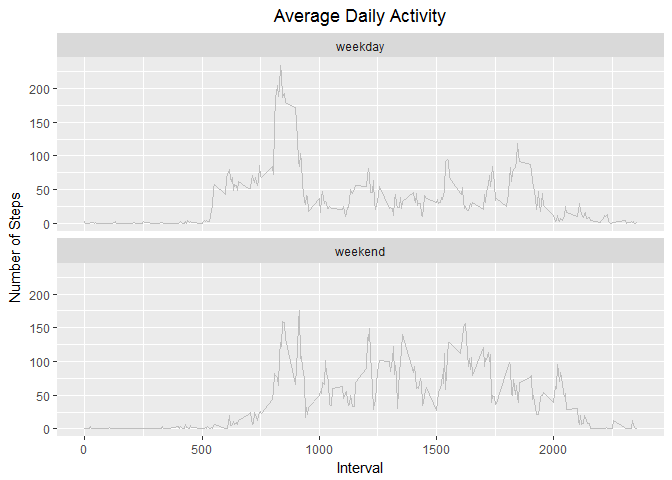

# Reproducible Research: Peer Assessment 1


## Loading and preprocessing the data
First import required packages: knitr, ggplot2 and dplyr.
Also set global **echo=TRUE**


```r
library(knitr)
library(ggplot2)
library(dplyr)
```

```
## 
## Attaching package: 'dplyr'
```

```
## The following objects are masked from 'package:stats':
## 
##     filter, lag
```

```
## The following objects are masked from 'package:base':
## 
##     intersect, setdiff, setequal, union
```

```r
opts_chunk$set(echo = TRUE)
options(scipen = 999)
```

Unzip file.


```r
unzip("activity.zip")
activity <- read.csv("activity.csv")
str(activity)
```

```
## 'data.frame':	17568 obs. of  3 variables:
##  $ steps   : int  NA NA NA NA NA NA NA NA NA NA ...
##  $ date    : Factor w/ 61 levels "2012-10-01","2012-10-02",..: 1 1 1 1 1 1 1 1 1 1 ...
##  $ interval: int  0 5 10 15 20 25 30 35 40 45 ...
```

We can see that date variable is not in **Date** format. Let's convert it.


```r
activity$date = as.Date(activity$date, "%Y-%m-%d")
class(activity$date)
```

```
## [1] "Date"
```

```r
head(activity)
```

```
##   steps       date interval
## 1    NA 2012-10-01        0
## 2    NA 2012-10-01        5
## 3    NA 2012-10-01       10
## 4    NA 2012-10-01       15
## 5    NA 2012-10-01       20
## 6    NA 2012-10-01       25
```

## What is mean total number of steps taken per day?

First we calculate the total steps per day by using aggregate function and then plot histogram. For the below plot binwidth is 2000. 


```r
steps.per.day <- aggregate(steps ~ date, data= activity, sum)
ggplot(steps.per.day , aes(steps)) +  geom_histogram(fill = "gray", binwidth = 2000) + labs(title="Histogram of Total Steps Taken per Day", x="Steps per Day", y="Frequency") + theme(plot.title = element_text(hjust = 0.5))
```

<!-- -->

Mean and Median of number of steps taken per day


```r
steps.mean <- mean(steps.per.day$steps)
steps.median <- median(steps.per.day$steps)
```

Mean is about 10766.1886792  and Median is 10765

## What is the average daily activity pattern?

We would like to get the data about on an average how many steps are taken at a particular time of day. So we should average over all days.


```r
steps.interval <- aggregate(steps ~ interval, data= activity, mean)
ggplot(steps.interval, aes(interval, steps)) + geom_line(color="gray") + labs(title = "Average Daily Activity", x = "Interval", y = "Number of Steps") + theme(plot.title = element_text(hjust = 0.5))
```

<!-- -->

Let's calcuate the interval where, on an average, maximum steps are taken.


```r
max.steps <- floor(steps.interval[which.max(steps.interval$steps), ])
```

So on average across all the days in the dataset, 835 interval contains the maximum number of steps equal to 206

## Imputing missing values
 

```r
num.missing.values <- sum(is.na(activity$steps))
percentage <- floor(num.missing.values/length(activity$steps)*100)
```

 Total number of missing values in the dataset is 2304 which is about 
13% of total data.

Let's replace missing values in a 5-minute interval by mean for that interval.


```r
na.rows <- which(is.na(activity$steps))
replace.missing <- function(index) {
    (steps.interval[steps.interval$interval == activity$interval[index], ]$steps)
}
```

Let's create a new dataset with missing data filled in.


```r
activity.full =  activity
activity.full$steps[na.rows] = sapply(na.rows, replace.missing)
head(activity.full)
```

```
##       steps       date interval
## 1 1.7169811 2012-10-01        0
## 2 0.3396226 2012-10-01        5
## 3 0.1320755 2012-10-01       10
## 4 0.1509434 2012-10-01       15
## 5 0.0754717 2012-10-01       20
## 6 2.0943396 2012-10-01       25
```

Lets plot the histogram of the total number of steps taken each day. Again bindwidth is 2000.


```r
steps.per.day <- aggregate(steps ~ date, data= activity.full, sum)
ggplot(steps.per.day , aes(steps)) +  geom_histogram(fill = "gray", binwidth = 2000) + labs(title="Histogram of Total Steps Taken per Day", x="Steps per Day", y="Frequency") + theme(plot.title = element_text(hjust = 0.5))
```

<!-- -->

```r
steps.mean <- mean(steps.per.day$steps)
steps.median <- median(steps.per.day$steps)
```

Mean is about 10766.1886792  and Median is 10766.1886792
Mean is same as previous which is obvious as we are replacing missing value with mean values only. Median has changed slightly and new median and mean are same.

As we can see from both histograms that frequency has increases for the second histogram. The reason being that the number of days/intervals with missing values are filled in. Hence there will be, on average, more intervals having a particular range of steps taken.


## Are there differences in activity patterns between weekdays and weekends?

Let's create a new column that will tell us whether day is **weekday** or **weekend**


```r
activity$day_type <- factor(rep("weekday", length(activity$date)), levels = c("weekday", "weekend"))
day_type <- weekdays(activity$date)
activity$day_type[which(day_type == "Saturday" | day_type == "Sunday")] = "weekend"
str(activity)
```

```
## 'data.frame':	17568 obs. of  4 variables:
##  $ steps   : int  NA NA NA NA NA NA NA NA NA NA ...
##  $ date    : Date, format: "2012-10-01" "2012-10-01" ...
##  $ interval: int  0 5 10 15 20 25 30 35 40 45 ...
##  $ day_type: Factor w/ 2 levels "weekday","weekend": 1 1 1 1 1 1 1 1 1 1 ...
```

Let us draw two time series plot, one each for **weekday** and **weekend**, of the 5-minute interval and the average number of steps taken, averaged across all days


```r
steps.interval.day_type <- aggregate(steps ~ interval * day_type, data= activity, mean)
ggplot(steps.interval.day_type, aes(interval, steps)) + geom_line(color="gray") +  facet_wrap( ~ day_type, ncol =1) + labs(title = "Average Daily Activity", x = "Interval", y = "Number of Steps") + theme(plot.title = element_text(hjust = 0.5))
```

<!-- -->

The comparison shows that there is more steps taken on weekend overall especially during normal working hours suggesting that this person gets more time for walking/running on weekends
